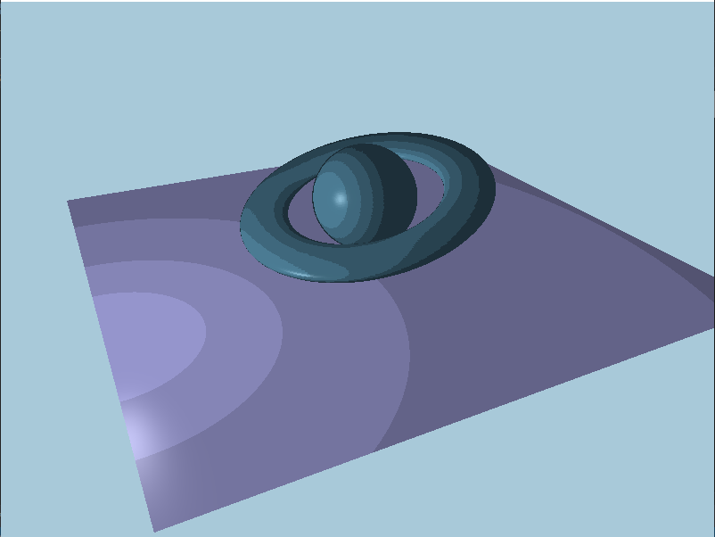

# Shaders!

A collection of shaders I have implemented in OpenGL for educational purposed. Enjoy the pictures :)

## Toon Shader

This was the first of many, I really enjoyed this project because there are so many games that I love that implement it so it felt nice getting to replicate some of my favorite games :)

